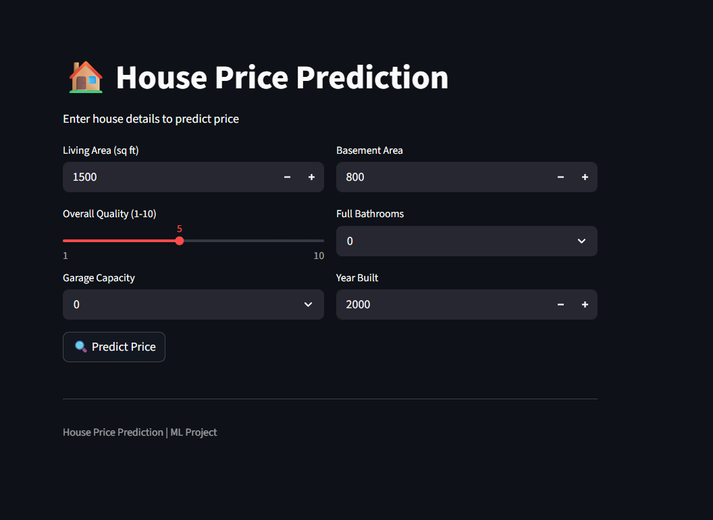
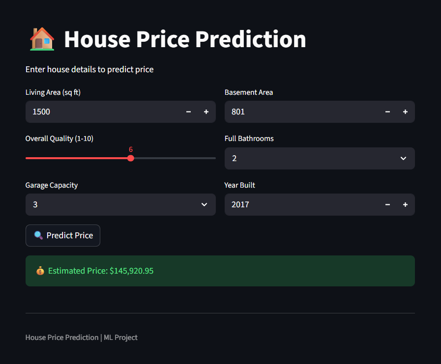

# 🏠 House Price Prediction (End-to-End ML Project)

## 📌 Overview

This project is an **end-to-end machine learning pipeline** that predicts house prices based on various property features.
It covers the complete workflow from **data analysis → preprocessing → feature engineering → model training → deployment**.

---

## 🚀 Features

* 📊 Exploratory Data Analysis (EDA)
* 🧹 Data preprocessing with missing value handling
* ⚙️ Feature engineering (encoding + scaling)
* 🤖 Model training (Linear Regression, Random Forest, XGBoost)
* 📈 Model evaluation (RMSE, R² Score)
* 🌐 Streamlit web app for real-time predictions
* 💾 Model & scaler persistence using Joblib

---

## 📂 Project Structure

```
house-price-prediction/
│
├── data/
│   ├── raw/
│   │   ├── train.csv
│   │   └── test.csv
│   │
│   └── processed/
│       ├── train_clean.csv
│       ├── X.csv
│       └── y.csv
│
├── notebooks/
│   ├── eda.ipynb
│   ├── data_preprocessing.ipynb
│   ├── feature_engineering.ipynb
│   └── train.ipynb
│
├── models/
│   ├── model.pkl
│   ├── scaler.pkl
│   ├── columns.pkl
│   └── num_cols.pkl
│
├── app/
│   └── app.py
│
├── reports/
│   └── figures/
|   └── screenshots/
│
├── requirements.txt
└── README.md
```

---

## 📊 Dataset

* Dataset: **House Prices - Advanced Regression**
* Source: Kaggle
* Rows: 1460
* Features: 80+
* Target: `SalePrice`

---

## 🔍 Key Insights (EDA)

* Target variable (`SalePrice`) is **right-skewed**
* Strong predictors:

  * Overall Quality
  * Living Area
  * Garage Capacity
* Missing values handled using domain knowledge
* Outliers removed for better model performance

---

## ⚙️ Data Preprocessing

* Dropped unnecessary columns (e.g., `Id`)
* Handled missing values:

  * `"None"` for missing categorical features
  * Median / neighborhood-based imputation
* Removed extreme outliers

---

## 🛠 Feature Engineering

* Log transformation applied to target variable
* One-hot encoding for categorical features
* Feature scaling using `StandardScaler`
* Saved:

  * `scaler.pkl`
  * `columns.pkl`
  * `num_cols.pkl`

---

## 🤖 Models Used

| Model             | Description           |
| ----------------- | --------------------- |
| Linear Regression | Baseline model        |
| Random Forest     | Handles non-linearity |
| XGBoost           | Best performance      |

---

## 📈 Evaluation Metrics

* RMSE (Root Mean Squared Error)
* R² Score

---

## 🏆 Best Model

* Selected based on lowest RMSE
* Saved as `model.pkl`

---

## 🌐 Web App (Streamlit)

### Features:

* User-friendly UI
* Real-time predictions
* Input-based inference

### Run App:

```bash
streamlit run app/app.py
```

---

## ⚠️ Important Note

To ensure consistency between training and prediction:

* Feature columns are saved (`columns.pkl`)
* Numerical columns are tracked (`num_cols.pkl`)
* Input data is aligned using `reindex()`

---

## 🧠 Skills Demonstrated

* Data Analysis & Visualization
* Feature Engineering
* Machine Learning Modeling
* Model Evaluation
* Deployment (Streamlit)
* End-to-End ML Pipeline Design

---

## 📦 Installation

```bash
git clone https://github.com/your-username/house-price-prediction.git
cd house-price-prediction

pip install -r requirements.txt
```
---

## 📸 Project Demo

### 🏠 App Interface


### 🔍 Prediction Example


### 🎥 Live Demo


---

## 🚀 Future Improvements

* Use `Pipeline` and `ColumnTransformer`
* Add more user input features (categorical)
* Hyperparameter tuning
* Deploy on cloud (Streamlit Cloud / Render)
* Add batch prediction support

---

## 👨‍💻 Author

* Pranish Sapkota
  Aspiring Data Scientist / AI Engineer

---

## ⭐ If you like this project

Give it a ⭐ on GitHub!
